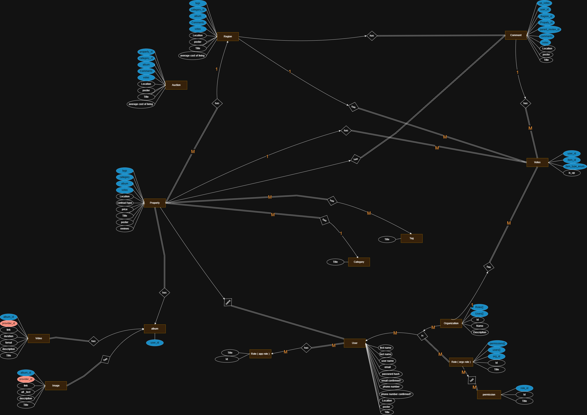

# Real Estate Full Stack App

## 1. Overview

This project is a full-stack real estate application featuring a backend API, a customer-facing frontend, and an admin dashboard. It allows users to browse, search, and inquire about properties, while admins can manage listings and users.

featuring:

- A backend API (ASP.NET Core Web API)
- A customer-facing frontend (Angular)
- An admin dashboard (Next.js)

---

## 2. Backend

- Built with: **ASP.NET Core Web API**
- Features:
  - RESTful API for property, user, and inquiry management
  - Authentication and authorization (JWT-based)
  - Database integration **(Entity Framework Core with SQL Server)**
  - Validation and error handling
  - Modular architecture (Domain, Application, Infrastructure, API)
  - Controllers for Auctions, Auth, Categories, Customers, Employees, Organizations, Properties, Regions, Tags

---

## 3. Customer Frontend

- Built with: **Angular ([Navigate](url))**
- Features:
  - Property browsing and search
  - Property details view
  - Inquiry/contact forms
  - User registration and login
  - Modern UI **(PrimeNG - TailwindCSS - SASS)**

---

## 4. Admin Frontend

- Built with: **Next.js ([Navigate](url))**
- Features:
  - Admin authentication
  - Property CRUD operations
  - User management
  - Dashboard with analytics
  - Modern UI **(MUI - TailwindCSS - SASS - Chart.js)**

---

## 5. ERD (Entity Relationship Diagram)

To include ERD images in this section:

1. Save your ERD image(s) in the project directory, e.g., `docs/erd.png`.
2. Reference the image using Markdown:

   ```markdown
   
   ```

3. You can include multiple images if needed.

---

## 6. Notes

- Update environment variables as needed in `.env` files.
- See individual subfolders for more detailed setup instructions (API, Application, Domain, Infrastructure, Client, client.admin).
- For questions or issues, please open an issue in this repository.
