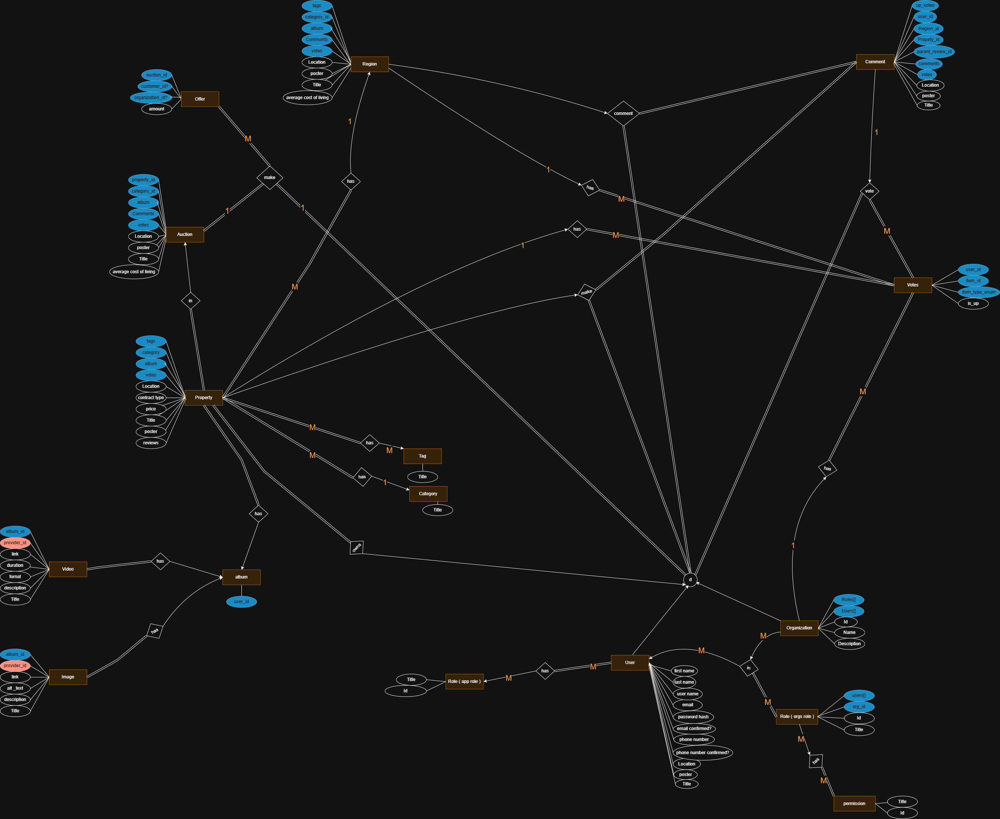

# Real Estate Full Stack App (under development)

## 1. Overview 

This project is a full-stack real estate application featuring a backend API, a customer-facing frontend, and an admin dashboard. It allows users to browse, search, and inquire about properties, while admins can manage listings and users.

Structure:

- A backend API (ASP.NET Core Web API)
- A customer-facing frontend (Angular)
- An admin dashboard (Next.js)

Features:

- Property: 
	- Customer/Org/Admin Management ( CRUD )
	- Browsing ( by title/location/rooms count/conctract type'rent etc..' )
	- Commenting + voting
	- Augmented reality preview
	- map 
- Auctions:
	- Set up properties for auctions
	- Live chat ( public/private with owner )
- Organizations:
	- Management ( CRUD + members + roles ) + activity tracking
	- Add properties as Organization
	- Set up employees to manage properties

---

## 2. Backend

Built with: **ASP.NET Core Web API**
Features:
- RESTful API for property, user, and inquiry management
- Authentication and authorization (JWT-based) + OAuth 2.0
- Database integration **(Entity Framework Core with SQL Server)**
- Validation and error handling
- Modular architecture (Domain, Application, Infrastructure, API)
- Controllers for Auctions, Auth, Categories, Customers, Employees, Organizations, Properties, Regions, Countries, Cities, Tags

---

## 3. Customer Frontend

Built with: **Angular ([Navigate](url))**
UI Kits: **(PrimeNG - TailwindCSS - SASS)**
Features:
- Property: 
  - Customer/Org Management ( CRUD )
  - Browsing ( by title/location/rooms count/conctract type'rent etc..' )
  - Commenting + voting
  - Augmented reality preview
  - map 
- Property browsing and search
- Property details view
- User registration and login

---

## 4. Admin Frontend

- Built with: **Next.js ([Navigate](url))**
- UI Kits: **(MUI - TailwindCSS - SASS - Chart.js)**
- Features:
  - Admin authentication
  - Property CRUD operations
  - User management
  - Dashboard with analytics

---

## 5. E.ERD (Enhanced Entity Relationship Diagram)

---

## 6. Notes

- Update environment variables as needed in `.env` files.
- See individual subfolders for more detailed setup instructions (API, Application, Domain, Infrastructure, Client, client.admin).
- For questions or issues, please open an issue in this repository.
